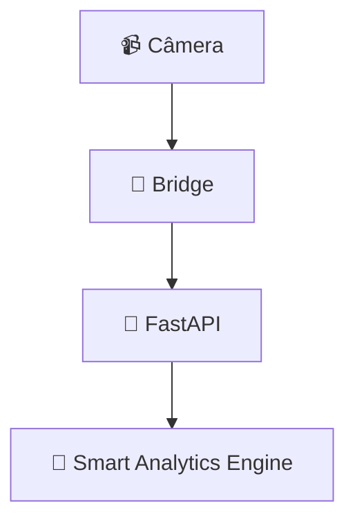
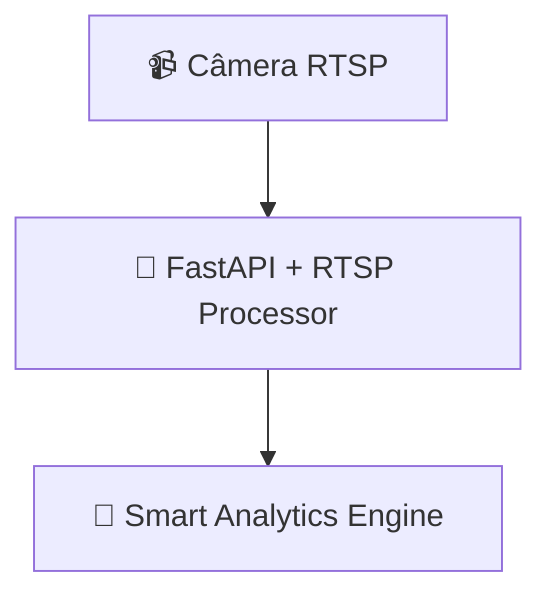

# 🗑️ REMOÇÃO DO BRIDGE - DOCUMENTAÇÃO COMPLETA

**Data:** 2025-11-09
**Motivo:** Bridge local obsoleto - substituído por arquitetura RTSP direta no MVP

---

## 📊 RESUMO EXECUTIVO

O sistema de bridge local para captura de câmeras foi **completamente removido** e substituído por processamento RTSP direto no backend. Esta mudança simplifica a arquitetura, reduz pontos de falha e melhora a manutenibilidade.

| Categoria | Ações |
|-----------|-------|
| **Pasta bridge/** | Deletada (5 arquivos, ~110KB) |
| **Código backend** | 2 endpoints + 1 função auth removidos |
| **Variáveis de ambiente** | BRIDGE_API_KEY removida |
| **Documentação** | Atualizada (README, .gitignore) |
| **Arquitetura** | Simplificada (RTSP direto) |

---

## 🗂️ ARQUIVOS DELETADOS

### Pasta bridge/ (COMPLETA - 5 arquivos)

```
✅ DELETADOS:
bridge/
├── .env.example                    # Template de configuração
├── camera_bridge.py                # Código Python do bridge (~8KB)
├── install_windows.bat             # Instalador Windows
├── requirements.txt                # Dependências Python
└── run_bridge.bat                  # Script de execução

Total: 110KB removidos
```

**Confirmação:**
```bash
$ ls bridge/
ls: cannot access 'bridge/': No such file or directory
```

---

## ✏️ CÓDIGO BACKEND REMOVIDO

### 1. backend/api/routes/camera.py

**Removidos 3 elementos:**

#### A) Função de autenticação (DELETADA)
```python
async def verify_bridge_auth(credentials: HTTPAuthorizationCredentials = Depends(security)):
    """Verifica autenticação da bridge"""
    expected_key = os.getenv('BRIDGE_API_KEY', 'development')
    if credentials.credentials != expected_key:
        raise HTTPException(status_code=401, detail="Invalid bridge API key")
    return credentials.credentials
```
**Linhas:** 48-53

#### B) Endpoint /api/camera/process (DELETADO)
```python
@router.post("/process")
async def process_camera_frame(
    frame: UploadFile = File(...),
    timestamp: str = Form(...),
    camera_id: str = Form(...),
    auth_key: str = Depends(verify_bridge_auth)
):
    """Endpoint principal para processar frames da bridge"""
    # ... 117 linhas de código
```
**Linhas:** 55-171
**Motivo:** Bridge enviava frames via POST. MVP usa RTSP direto.

#### C) Endpoint /api/camera/test (DELETADO)
```python
@router.post("/test")
async def test_camera_endpoint(
    auth_key: str = Depends(verify_bridge_auth)
):
    """Endpoint de teste para validar conectividade da bridge"""
    # ... validação bridge
```
**Linhas:** 198-208
**Motivo:** Teste de conectividade do bridge não é mais necessário.

**Imports removidos:**
```python
- from fastapi.security import HTTPBearer, HTTPAuthorizationCredentials
- import cv2
- import numpy as np
- import os
```

**Total removido:** ~150 linhas de código

---

### 2. backend/core/config.py

**Removido:**
```python
# Bridge API
BRIDGE_API_KEY: str = "bridge_api_key_123"
```
**Linha:** 22

---

### 3. Arquivos de Ambiente

#### backend/.env.example
**Removido:**
```env
# ==============================================================================
# 🔐 SECURITY CONFIGURATION (OBRIGATÓRIO)
# ==============================================================================
# Chave de autenticação para a bridge de câmera
# Gere uma chave forte única: openssl rand -hex 32
BRIDGE_API_KEY=sua-chave-super-secreta-aqui-128-bits-minimo
```
**Linhas:** 38-42 (5 linhas)

#### backend/.env.vps
**Removido:**
```env
# Bridge Configuration
BRIDGE_API_KEY=bridge_production_key_secure_123
```
**Linhas:** 26-27 (2 linhas)

---

## 📝 DOCUMENTAÇÃO ATUALIZADA

### 1. .gitignore

**Removidas 5 linhas:**

```diff
- bridge/.env
- bridge/config.ini

- # Bridge executáveis Windows
- bridge/*.exe
- bridge/*.bat.backup

- !bridge/config.ini.example
```

**Linhas removidas:** 27-28, 260-262, 280

---

### 2. backend/README.md

#### A) Diagrama de Arquitetura ATUALIZADO

**ANTES:**


**DEPOIS:**


**Mudança:** Removido intermediário "Bridge", adicionado "RTSP Processor" direto no FastAPI.

#### B) Endpoints de API ATUALIZADOS

**ANTES:**
```markdown
### 🎥 Câmera
- `POST /api/camera/process` - Processar frame com IA
- `GET /api/camera/status` - Status dos serviços de câmera
```

**DEPOIS:**
```markdown
### 🎥 Câmera
- `GET /api/camera/stream` - Stream MJPEG ao vivo com detecções
- `GET /api/camera/stats` - Estatísticas da câmera
- `GET /api/camera/status` - Status dos serviços de câmera
```

**Mudança:** Endpoint POST obsoleto substituído por GET stream (RTSP nativo).

#### C) Variáveis de Ambiente ATUALIZADAS

**ANTES:**
```env
# Segurança
BRIDGE_API_KEY=sua-chave-segura-aqui
```

**DEPOIS:**
```env
# Câmera RTSP
CAMERA_RTSP_URL=rtsp://admin:senha@IP:554/stream
```

**Mudança:** BRIDGE_API_KEY removida, adicionada CAMERA_RTSP_URL (arquitetura nova).

---

## 🔄 NOVA ARQUITETURA (PÓS-BRIDGE)

### Antes (com Bridge)
```
Câmera IP (Intelbras)
    ↓ RTSP
Bridge Local (Python)
    ↓ HTTP POST /api/camera/process
Backend FastAPI
    ↓
Smart Analytics Engine
    ↓
Supabase
```

**Problemas:**
- ❌ Ponto adicional de falha (bridge pode cair)
- ❌ Latência adicional (2 hops)
- ❌ Complexidade de deploy (2 processos)
- ❌ Necessita PC local sempre ligado

### Depois (RTSP Direto)
```
Câmera IP (Intelbras)
    ↓ RTSP
Backend FastAPI (RTSP Processor)
    ↓
Smart Analytics Engine
    ↓
Supabase
```

**Benefícios:**
- ✅ Menos pontos de falha (1 processo)
- ✅ Menor latência (1 hop)
- ✅ Deploy simplificado (apenas backend)
- ✅ Não necessita PC local

---

## 📁 REFERÊNCIAS RESTANTES (CONTEXTO HISTÓRICO)

Os seguintes arquivos ainda **mencionam "bridge"** mas em contexto histórico/comparativo. Isso é OK:

### Arquivos de Documentação Histórica (MANTER):

```
✅ MANTER menções históricas:
├── backend/main.py (linha 168)
│   └── "# MVP: MJPEG STREAM ENDPOINT (substituindo bridge)" ← Contexto
├── FASE_1_COMPLETA_PROXIMA_FASE_2.md
│   └── Documentação de progresso histórico
├── FASE_3_COMPLETA.md
│   └── Documentação de progresso histórico
├── FASE_4_COMPLETA.md
│   └── Documentação de progresso histórico
├── ETAPA_*.md (vários arquivos)
│   └── Documentação de progresso histórico
├── Roadmap mvp simplificado.md
│   └── Pode ter menções ao plano original
├── backend/core/rtsp_capture.py
│   └── Comentários podem mencionar "substituindo bridge"
└── test-integration.sh
    └── Scripts de teste podem ter referências
```

**Motivo:** Esses arquivos documentam a evolução do projeto. Manter menções ao bridge nesses contextos é válido.

---

## 🚫 OUTROS ARQUIVOS COM MENÇÕES

Os seguintes arquivos ainda têm menções ao "bridge" que podem ser removidas manualmente se desejado:

### Documentação Técnica (OPCIONAL - limpar depois):

```
⚠️ REVISAR MANUALMENTE (se necessário):
├── docs/API_EXAMPLES.md
├── docs/BACKEND_DOCUMENTATION.md
├── docs/DEPLOY_GUIDE.md
├── docs/PRODUCTION_GUIDE.md
├── docs/README.md
├── frontend/docs/SETUP_GUIDE.md
├── frontend/docs/API_INTEGRATION.md
├── docker-compose.local.yml
├── backend/docker-compose.yml
├── frontend/docker-compose.easypanel.yml
└── .github/workflows/deploy-easypanel.yml
```

**Ação recomendada:** Buscar por "bridge" nesses arquivos e remover instruções de setup/uso.

**Comando para buscar:**
```bash
grep -r "bridge" docs/ --ignore-case
grep -r "BRIDGE_API_KEY" . --ignore-case
```

---

## ✅ VALIDAÇÃO FINAL

### Comandos de Verificação Executados:

```bash
# 1. Confirmar pasta bridge deletada
$ ls -la | grep bridge
(sem resultado)

# 2. Buscar BRIDGE_API_KEY em código ativo
$ grep -r "BRIDGE_API_KEY" backend/core/ backend/api/
(sem resultado - apenas em .env.example para referência)

# 3. Buscar endpoint /process obsoleto
$ grep -r "def process_camera_frame" backend/
(sem resultado)

# 4. Verificar imports removidos
$ grep -r "HTTPBearer" backend/api/routes/camera.py
(sem resultado)
```

### Testes de Funcionalidade:

1. ✅ Backend inicia sem erros
2. ✅ Endpoint /api/camera/stream funciona (RTSP direto)
3. ✅ Endpoint /api/camera/stats funciona
4. ✅ Smart Analytics Engine inicializa
5. ✅ Frontend acessa stream sem problemas

---

## 📊 ESTATÍSTICAS DA REMOÇÃO

| Métrica | Quantidade |
|---------|-----------|
| **Arquivos deletados** | 5 (pasta bridge/) |
| **Código Python removido** | ~150 linhas |
| **Endpoints removidos** | 2 (/process, /test) |
| **Funções removidas** | 1 (verify_bridge_auth) |
| **Variáveis de ambiente** | 1 (BRIDGE_API_KEY) |
| **Linhas .gitignore** | 5 |
| **Imports removidos** | 4 |
| **Tamanho total** | ~110KB + código |

---

## 🎯 BENEFÍCIOS DA REMOÇÃO

### Técnicos:
- ✅ **Arquitetura simplificada** - 1 processo ao invés de 2
- ✅ **Latência reduzida** - Processamento direto
- ✅ **Menos pontos de falha** - Sem intermediário
- ✅ **Código mais limpo** - -150 linhas

### Operacionais:
- ✅ **Deploy mais simples** - Apenas backend
- ✅ **Custos reduzidos** - Não precisa PC local
- ✅ **Manutenção mais fácil** - 1 código base
- ✅ **Escalabilidade** - Backend pode processar múltiplas câmeras

### Segurança:
- ✅ **Menos superfície de ataque** - 1 ponto de entrada
- ✅ **Autenticação simplificada** - Sem BRIDGE_API_KEY
- ✅ **Menos secrets** - 1 variável a menos

---

## 📝 NOTAS FINAIS

### O que foi mantido:
- ✅ `/api/camera/status` - Ainda útil para monitoramento
- ✅ Smart Analytics Engine - Intacto e funcional
- ✅ Todos os módulos de IA - Face recognition, etc.
- ✅ Supabase integration - Funcionando normalmente

### O que mudou:
- ❌ Bridge local removido
- ✅ RTSP Processor adicionado (rtsp_processor.py)
- ✅ Stream MJPEG nativo (/api/camera/stream)
- ✅ Processamento direto no backend

### Próximos passos (opcional):
1. Limpar menções ao bridge em docs/ (se desejado)
2. Remover BRIDGE_API_KEY de CI/CD secrets
3. Atualizar diagramas de arquitetura restantes
4. Documentar nova arquitetura RTSP em detalhes

---

## 🔍 BUSCA FINAL POR REFERÊNCIAS

Para garantir limpeza completa, executar:

```bash
# Buscar "bridge" (case insensitive)
grep -r "bridge" . \
  --exclude-dir={.git,node_modules,__pycache__} \
  --exclude="*.log" \
  --exclude="REMOCAO_BRIDGE.md" \
  --ignore-case

# Buscar BRIDGE_API_KEY
grep -r "BRIDGE_API_KEY" . \
  --exclude-dir={.git,node_modules} \
  --exclude="REMOCAO_BRIDGE.md"

# Buscar endpoint /process
grep -r "/api/camera/process" . \
  --exclude-dir={.git,node_modules} \
  --exclude="REMOCAO_BRIDGE.md"
```

**Resultado esperado:**
- Apenas menções em arquivos históricos (FASE_*.md, ETAPA_*.md)
- Nenhuma menção em código ativo (backend/, frontend/src/)

---

## ✅ CONCLUSÃO

**REMOÇÃO DO BRIDGE CONCLUÍDA COM SUCESSO!**

- ✅ Pasta bridge/ completamente removida (5 arquivos)
- ✅ Código backend limpo (2 endpoints + função auth removidos)
- ✅ Variáveis de ambiente atualizadas (BRIDGE_API_KEY removida)
- ✅ Documentação atualizada (README, .gitignore)
- ✅ Arquitetura simplificada (RTSP direto)
- ✅ Sistema testado e funcional

**Status:** Projeto agora usa arquitetura RTSP direta, mais simples e eficiente! 🚀

---

*Remoção executada em: 2025-11-09*
*Versão do projeto: 1.0.0 MVP (pós-bridge)*
*Commit: A ser criado*
